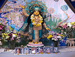
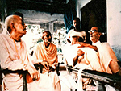

<HTML>
<HEAD>
</HEAD>
<BODY bgcolor="#FFFFFF">
<table width="516" cellspacing="0" cellpadding="8" class="body" align="center" bgcolor="#FFFFFF">
  <tr> 
    <td> 
      <blockquote> 
        
All 
          glories to Sri Guru and Sri Gauranga<i> 
          </i>

      </blockquote>
    </td>
  </tr>
  <tr> 
    <td> 
      
<b>Bhakti Yoga Club</b> 

      
What We've Been Searching for.
 
        by Kishore Krishna Das 
      

      

      
 Hare Krsna! This is website for Bhakti Yoga Club Provo. We're a growing group committed to the sublime philosophy of Krishna Consciousness (Nama-Kirtan) as illuminated by Sri Chaitanya Mahaprabhu 500 years ago in West Bengal. Our spiritual practice surrounds <a href="https://www.youtube.com/watch?v=WDE1UlZp60Y">the chanting of the Hare Krsna Maha Mantra in congregation</a>, <a href="https://www.youtube.com/channel/UCHQCoQpYvsqmp0Oy2EQagmA">Having talks and discourses on God (Sri Krsna-- Reality The Beautiful</a> and the nature of the pure reality, the honoring of Maha-Prasadam (Holy Food), and Vaishnava-Seva (serving the Vaishnava devotees). Our spiritual conception is based on pure positive and progressive theism as illuminated by Srila Rupa Goswami, <a href="https://premadharma.org/library/#srila-bhakti-siddhanta-saraswati-thakur">Srila Bhaktisiddhanta Saraswati Thakur Prabhupada</a>, and his most dear disciple >Srila Bhakti Raksak Sridhar Dev-Goswami Maharaj. In our conception The Absolute; God is a person-- and He is pure, beautfiul Reality far removed from the tainting of material existence, provincial-localized interest, and the notion of negativist liberation in undifferentiated-monistic oneness (Brahman).

In a nutshell-- We are chanting the holy names of Sri Krsna and making an attempt to give honor and respect to all others-- seeing all parts as part of an organic ontological whole which is being lovingly and attentively attended to by the source of all sweetness and consciousness. Reality is a flow of waves of incredible love and beauty (Rasa) and we are attempting, however unsuccessfully, to receive those waves in accordance with the grace that has been administered to us by our Guru-Varga. Hare Krsna. Nitai Gaura Haribol.
        

      
We have outdoor Kirtan in Provo (most) every night when the weather allows, programs for honoring Lord Krsna's Prasadam (holy food), and we're offering a carpool shuttle up to the SCS Mission in Salt Lake for anyone who wants to associate. Also! A library of books by our beloved Srila Sridhar Maharaj and his foremost disciple Srila Govinda Maharaj can be found at <a href="http://scsmath.org/publications/publications-pdfs.html">here.</a>
  
   
   

<a href="https://vedabase.io/en/library/cc/madhya/15/110/">ākṛṣṭiḥ kṛta-cetasāṁ sumanasām uccāṭanaṁ cāṁhasām  
ācaṇḍālam amūka-loka-sulabho vaśyaś ca mukti-śriyaḥ  
no dīkṣāṁ na ca sat-kriyāṁ na ca puraścaryāṁ manāg īkṣate   
mantro 'yaṁ rasanā-spṛg eva phalati śrī-kṛṣṇa-nāmātmakaḥ
</a>
      
<i>-- 
        Kishore Krishna Das 
        </i>

       
     
  </tr>
  <tr> 
    <td> Sri 
      Chaitanya Saraswat Math, Nabadwip 
      <a href="http://scsmath.com">http://scsmath.com</a> 
      | <a href="http://scsmath.com/centers.html">Main Centres</a> | <a href="http://scsmath.com/new.html">What's&nbsp;New?</a></td>
  </tr>
  <tr>
    <td>
      

    </td>
  </tr>
</table>

